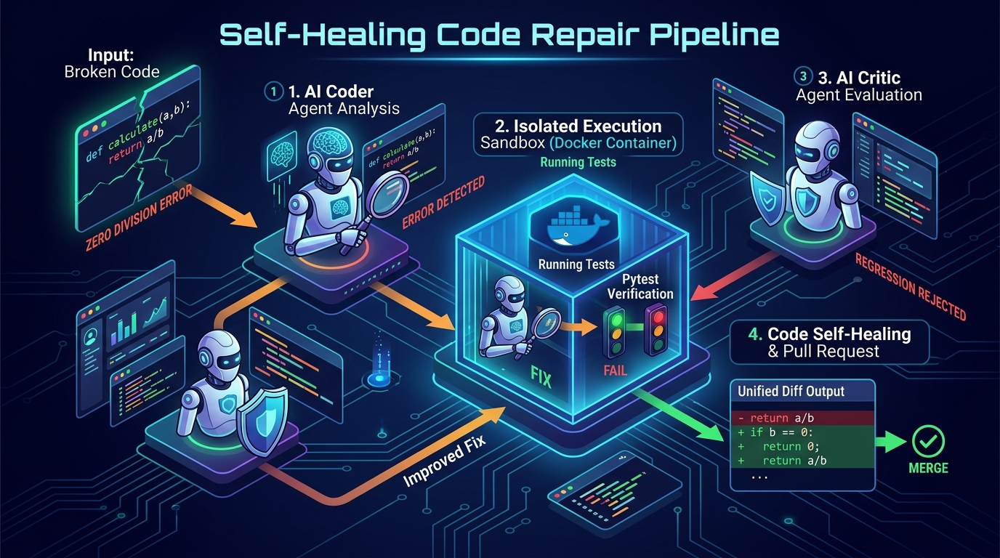
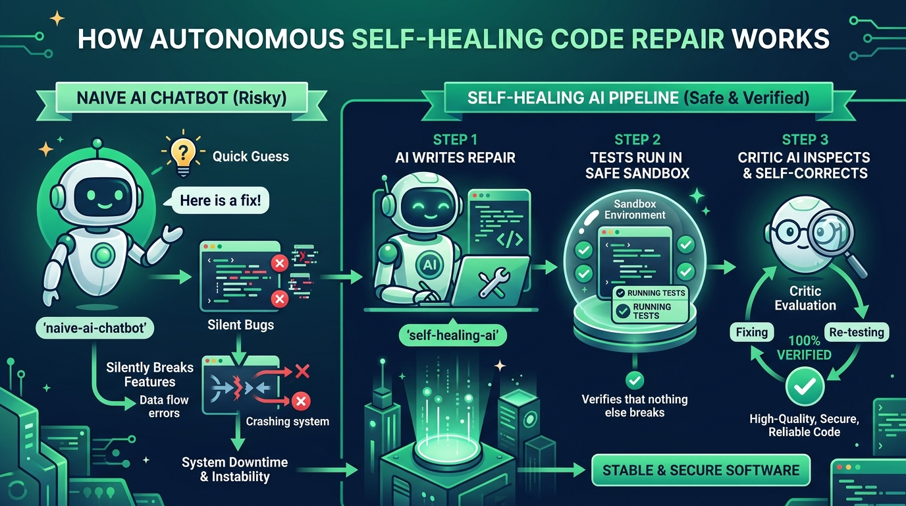
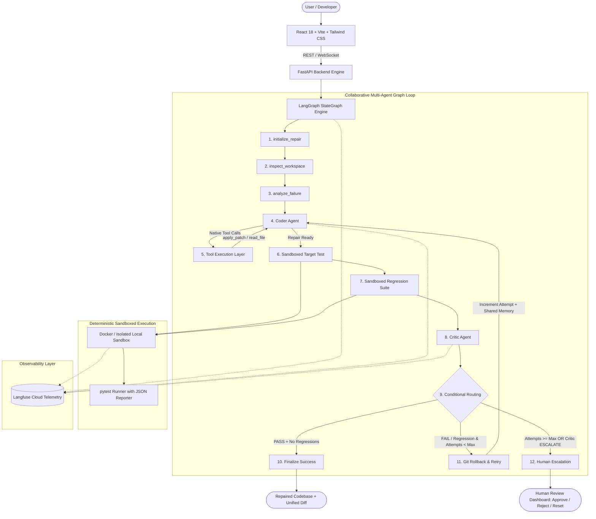

# Self-Healing Code Repair Pipeline

> **An autonomous, stateful, tool-using AI system that diagnoses broken Python code, generates a repair, executes it safely in a sandbox, detects regressions, critiques its own solution, retries intelligently, and escalates to a human when necessary.**
for mm


[](https://www.python.org/downloads/)
[](https://fastapi.tiangolo.com/)
[](https://www.langchain.com/langgraph)
[](https://groq.com/)
[](https://cloud.langfuse.com)
[](https://react.dev/)
[](https://tailwindcss.com/)
[]()

---



---

## 🌟 1. Project Overview

The **Self-Healing Code Repair Pipeline** is an autonomous multi-agent software engineering system that treats **the execution environment and objective test outcomes as the sole authority of truth**.

Traditional AI coding assistants act as passive chatbots or execute fragile linear `while` loops that blindly accept code changes without deterministic verification. This system implements a **collaborative, stateful agent architecture** where:

* Code repairs are proposed by a **Coder Agent** using **Native Groq Tool / Function Calling**.
* Proposed patches are validated for syntax and safety, applied to an isolated workspace, and tracked with Git.
* Tests are executed strictly inside a **sandboxed environment** (Docker container or isolated local sandbox).
* An impartial **Critic Agent** inspects objective test results (both the target test and the existing regression suite) to verify fixes.
* If a fix introduces a regression or fails tests, the system rolls back changes, updates **shared working memory** with the failure analysis, and re-routes execution back to the Coder for intelligent revision.
* If repairs do not converge within the maximum configured attempts, the pipeline safely halts and **escalates to human review**.

---

## 👶 2. Full Layman Guide (How It Works in Plain English)



### Why Do Typical AI Chatbots Break Code?
When you ask a standard AI chatbot (like ChatGPT) to fix code, it makes a **quick guess**. That guess might solve your single broken line, but it often **silently breaks other existing features** in your software (called a *regression*). In the real world, this causes bugs, crashes, and downtime.

### How Our Self-Healing Pipeline Fixes It Safely:
Our system acts like an automated engineering team with safeguards:

1. **Step 1 - The Coder AI Analyzes**: The AI reads the broken file and runs the failing test to see the exact error. It formulates a hypothesis and proposes a minimal fix.
2. **Step 2 - Isolated Sandbox Execution**: The fix is executed inside a secure, quarantined container (Docker or local sandbox). It runs the target test **AND all your existing tests**.
3. **Step 3 - The Critic AI & Self-Healing Loop**:
   - If the AI's fix solved the broken test **BUT broke an existing feature**: The system *rejects* the bad fix, rolls back the code to clean state, and tells the Coder AI: *"Your first guess broke feature X. Try again without repeating that mistake."*
   - **Attempt 2**: The Coder AI uses that memory to generate a complete, corrected fix that passes **100% of all tests**.
4. **Step 4 - Human Safety Net**: If the AI cannot solve the issue within your chosen attempt limit (e.g. 3 attempts), it never deploys broken code. It pauses and asks an engineer for human sign-off!

---

## 🖥️ 3. Four Intuitive Configuration Modes (Easy for Beginners)

On the **New Repair** screen ([http://localhost:5174/repairs/new](http://localhost:5174/repairs/new)), you have four ways to configure a repair:

```text
┌─────────────────┬─────────────────────┬─────────────────┬─────────────────┐
│ 1-Click Presets │  Scan Local Folder  │  Upload Files   │   Code Editor   │
│  (For Laymen)   │  (Auto-Discovery)   │  (Drag & Drop)  │ (For Engineers) │
└─────────────────┴─────────────────────┴─────────────────┴─────────────────┘
```

1. **🌟 1-Click Presets**:
   - Pick from pre-configured software defects with layman explanations:
     - 🛒 **E-Commerce Promo Discount**: Handles `'20%'` strings vs `0.20` decimals (demonstrates the 2-attempt self-healing loop).
     - 🧮 **Accounting Sales Tax**: Rounding bug losing fractional pennies.
     - 🔍 **Search Engine Index Finder**: Off-by-one boundary bug in binary search.
     - 🛡️ **Safe User Profile Accessor**: Crash on missing user settings.
2. **📁 Scan Local Folder Path**:
   - Type or paste any directory path on your computer (e.g. `examples/regression_demo` or `C:\my_project`).
   - Click **"Scan Folder"**—the system discovers all `.py` files, extracts test functions, and provides dropdown menus to configure the job automatically!
3. **📤 Upload Files Directly**:
   - Simple file pickers to select your broken Python file, target test file, and regression test suites directly from your machine with zero copy-pasting.
4. **✏️ Manual Code Editor**:
   - Full code view for developers who want to inspect and edit raw Python code directly.

---

## 🏗️ 4. High-Level Architecture



---

## 🧠 5. Why LangGraph?

1. **Stateful Multi-Turn Graph Execution**: Linear scripts and hardcoded loops (`while attempts < 3: ...`) cannot model branching, multi-agent debates, and conditional rollbacks cleanly. LangGraph provides an explicit directed state graph where nodes represent discrete engineering steps and edges represent deterministic decisions.
2. **Explicit Cyclic Feedback Loops**: Graph cycles allow the system to retry failed repairs naturally (`route_decision -> rollback -> coder`), preserving full state transitions and execution history across turns.
3. **Strongly Typed State**: The entire repair state is encapsulated in a validated Pydantic / TypedDict schema, ensuring all agents operate on identical, synchronized working memory without hidden isolated context.
4. **Resilience & Checkpointing**: Every graph step can be snapshotted, persisted, or paused for human intervention.

---

## 🛠️ 6. Why Native Tool Calling?

1. **Deterministic Structured Outputs**: Parsing LLM text with regular expressions or manual JSON regex extraction is brittle and prone to formatting errors, markdown hallucination, and injection bugs.
2. **First-Class Schema Validation**: Groq's native tool calling provides strict JSON Schema validation. The model produces genuine function calls (`read_file`, `apply_patch`, `run_target_test`) that are validated before execution.
3. **No Arbitrary Shell Access**: The LLM is **never** given arbitrary host shell execution (`run_shell` or `exec_command` are strictly prohibited). All interactions occur through whitelisted Python functions.

---

## 🐳 7. Why Docker & Sandboxing?

1. **Untrusted Code Execution**: LLM-generated code may contain accidental infinite loops, dangerous system calls, network access, or corrupted dependencies.
2. **Security & Sandboxing**:
   - Container runs as a non-privileged user (`sandboxuser`, UID 1001).
   - Read-only container root with a dedicated temporary workspace volume.
   - Resource quotas: CPU limit (1 core) and Memory limit (512 MB).
   - Execution timeout (default 30 seconds) enforced at container and process levels.
   - Network isolation (`--network=none`).
3. **Dual-Mode Sandbox Architecture**: When Docker is active, tests execute in a clean Docker container. If Docker is unavailable in local development or CI, the system seamlessly falls back to an isolated `LocalSandbox` with environment variable sanitization (all API keys and secrets stripped), execution timeouts, and workspace confinement.

---

## 📊 8. Why Langfuse Observability?

1. **End-to-End Distributed Tracing**: Every repair run creates a root trace (`repair_<id>`) that links all subsequent agent turns, tool invocations, and test runs into an organized hierarchy.
2. **Granular Spans & Generations**: Captures model prompts, completions, token usage (`prompt_tokens`, `completion_tokens`), and exact latencies for both Coder and Critic.
3. **Clickable Trace URLs**: Every repair provides direct trace links in the REST API, WebSocket stream, and frontend UI to view in the [Langfuse Cloud Dashboard](https://cloud.langfuse.com).

---

## 🤖 9. Agent Architecture

```text
                  +-----------------------------+
                  |         CODER AGENT         |
                  |  Model: openai/gpt-oss-120b |
                  +-----------------------------+
                                 |
                     Inspects code, tests, failure
                     Analyzes Critic critique & prior attempts
                     Emits native tool calls (apply_patch)
                                 |
                                 v
                  +-----------------------------+
                  |    OBJECTIVE VERIFICATION   |
                  |  Target Test + Regressions  |
                  +-----------------------------+
                                 |
                                 v
                  +-----------------------------+
                  |        CRITIC AGENT         |
                  |  Model: openai/gpt-oss-20b  |
                  +-----------------------------+
                                 |
                     Evaluates objective test results
                     Verifies absence of regressions
                     Assesses change minimalism & safety
                     Verdicts: PASS | REVISE | ESCALATE
```

---

## 📦 10. Native Tool Catalog

| Tool Name | Parameters | Description | Security Controls |
|---|---|---|---|
| `read_file` | `path: str` | Reads a workspace file | Workspace boundary checked; no absolute paths |
| `list_files` | `directory: str = "."` | Lists directory contents | Workspace confined |
| `get_file_metadata` | `path: str` | Returns size, language, mtime, hash | Workspace confined |
| `apply_patch` | `path: str, patch: str` | Applies search-and-replace or unified diff | Python AST syntax validation; test modification blocked |
| `write_file` | `path: str, content: str` | Writes full file content | Test suite modification prohibited |
| `get_diff` | none | Returns unified git diff against baseline | Read-only git inspection |
| `run_target_test` | `test_path: str` | Runs pytest target in sandbox | Executed in Docker/LocalSandbox with timeout & sanitized env |
| `run_regression_tests` | none | Runs full regression suite in sandbox | Executed in Docker/LocalSandbox with timeout & sanitized env |
| `create_checkpoint` | none | Commits git checkpoint | Local workspace git repo |
| `rollback` | `checkpoint_id: str` | Resets workspace to git commit | Restores clean code state on failed attempt |
| `get_test_summary` | none | Compact status of previous tests | Read-only state extraction |

---

## 🛡️ 11. Regression Detection Decision Matrix

| Target Test | Regression Suite | Critic Verdict | Graph Action | Next State |
|---|---|---|---|---|
| **FAIL** | PASS | REVISE | Rollback & Retry (if attempts < max) | `coder` |
| **FAIL** | FAIL | REVISE | Rollback & Retry (if attempts < max) | `coder` |
| **PASS** | **FAIL** | **REVISE** | **Rollback & Retry (Regression Detected!)** | `coder` |
| **PASS** | **PASS** | PASS | Finalize Success | `finalize_success` |
| Any | Any | ESCALATE | Escalate to Human | `human_escalation` |
| Any | Any | Any (attempts >= max) | Escalate to Human | `human_escalation` |

---

## ⚙️ 12. Installation & Quickstart

### Prerequisites
* **Python 3.12+**
* **Node.js 18+ & npm**
* **Git**
* *(Optional)* Docker Desktop

### 1. Setup Environment
```bash
git clone https://github.com/your-username/self-healing-code-repair-pipeline.git
cd self-healing-code-repair-pipeline

# Python virtual environment
python -m venv venv
.\venv\Scripts\activate   # Windows
# source venv/bin/activate # Linux/Mac

pip install -r backend/requirements.txt

# Frontend dependencies
cd frontend
npm install
cd ..
```

### 2. Configure Environment (`.env`)
Copy `.env.example` to `.env` and provide your API keys:
```env
GROQ_API_KEY=your_groq_api_key_here
CODER_MODEL=openai/gpt-oss-120b
CRITIC_MODEL=openai/gpt-oss-20b

LANGFUSE_ENABLED=true
LANGFUSE_PUBLIC_KEY=pk-lf-bf8cb6a8-0a31-4a65-bdaf-867abecbfbf0
LANGFUSE_SECRET_KEY=sk-lf-27ce595a-d4c8-465e-94c8-15a671010355
LANGFUSE_HOST=https://cloud.langfuse.com

BACKEND_PORT=8001
FRONTEND_PORT=5174
```

### 3. Launch the Application
```powershell
# Start Backend (Port 8001):
.\scripts\run_backend.ps1

# Start Frontend (Port 5174):
.\scripts\run_frontend.ps1
```

* **Frontend Dashboard**: [http://localhost:5174](http://localhost:5174)
* **Backend Swagger API**: [http://localhost:8001/docs](http://localhost:8001/docs)

---

## 🧪 13. Automated Tests & Benchmark Suite

### Run Automated Tests (16/16 Passing)
```bash
python -m pytest backend/tests -v
```

### Run 12-Task Benchmark Runner
```bash
python benchmarks/benchmark_runner.py
```

---

## 🎬 14. Built-in Demo Execution Trace

```text
==================================================
      SELF-HEALING CODE REPAIR PIPELINE       
==================================================
[*] Workspace initialized: demo_cli_1772971200
[*] Target test: test_target.py::test_discount_with_percentage_string
[*] Regression suite: test_regression.py (5 existing contracts)
[!] Baseline bug detected: `TypeError` on string discount '20%'

==================================================
                 ATTEMPT 1 / 3                    
==================================================
>>> CODER AGENT:
    Hypothesis: Parse string discount with strip('%') / 100
    Action: Applying patch to buggy_module.py

--- SANDBOX EXECUTION ---
    Target Test:      [PASS] (0.24s)
    Regression Suite: [FAIL] (0.31s) - 2 tests failed!
    Detected:         REGRESSION_FAILURE

>>> CRITIC AGENT:
    Verdict:    REVISE
    Confidence: 0.95
    Analysis:   Target test passed, but dividing by 100 broke decimal
                discount inputs (e.g. 0.20 became 0.002).

[!] Graph Router: Target PASS but Regression FAIL.
    Rolling back to baseline checkpoint and retrying...

==================================================
                 ATTEMPT 2 / 3                    
==================================================
>>> CODER AGENT:
    Learned from Critic feedback:
    Previous Attempt 1 broke decimal float contracts.
    Hypothesis: Distinguish '%' strings from raw decimal floats.
    Action: Applying corrected patch to buggy_module.py

--- SANDBOX EXECUTION ---
    Target Test:      [PASS] (0.21s)
    Regression Suite: [PASS] (0.28s) - All 5 tests passed!
    Detected:         ALL_TESTS_PASSING

>>> CRITIC AGENT:
    Verdict:    PASS
    Confidence: 0.99
    Analysis:   Both target string inputs and decimal contracts are
                correctly supported. No regressions detected.

==================================================
               REPAIR SUCCESSFUL!                 
==================================================
Attempts:           2
Target Test:        PASS
Regression Suite:   PASS
Files Changed:      1
Lines Added:        8
Lines Removed:      2
==================================================
```

---

## License

This project is licensed under the MIT License - see the [LICENSE](LICENSE) file for details.
