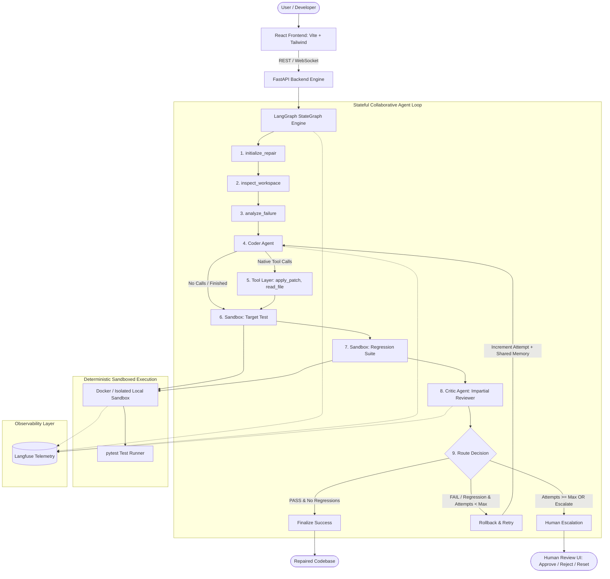
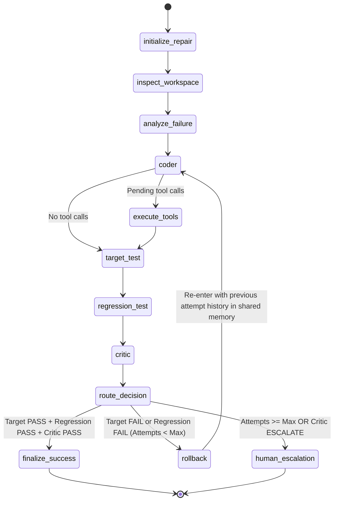

# Architecture Documentation: Self-Healing Code Repair Pipeline

The **Self-Healing Code Repair Pipeline** is an autonomous, stateful, collaborative multi-agent system designed for automated software repair with deterministic verification, sandboxed execution, regression prevention, and human review escalation.

Unlike naive linear agent loops or chatbot wrappers, this architecture establishes that **the execution environment and objective test outcomes are the sole authorities of truth**.

---

## 1. High-Level System Architecture



---

## 2. LangGraph State Machine & State Transitions

The execution is governed by a strongly typed `RepairState` TypedDict executed across explicit graph nodes:



---

## 3. Shared Working Memory Schema

State is maintained globally across all agents:

```python
class RepairState(TypedDict):
    task_id: str
    workspace_id: str
    workspace_path: str

    source_file: str
    test_file: str
    target_test: str
    regression_files: List[str]

    original_code: str
    current_code: str
    current_diff: str

    coder_plan: str
    coder_summary: str

    target_test_result: Dict[str, Any]
    regression_result: Dict[str, Any]

    critic_analysis: str
    critic_verdict: str  # "PASS", "REVISE", "ESCALATE"
    critic_confidence: Optional[float]

    attempt: int
    max_attempts: int

    failure_type: str
    root_cause: str

    attempts: List[Dict[str, Any]]
    errors: List[str]

    workspace_checkpoint_id: Optional[str]

    status: str

    trace_id: str
    trace_url: Optional[str]
```

### Attempt History Schema

Every cycle writes an immutable audit record injected into subsequent Coder prompts:
- Attempt Number
- Hypothesis & Plan
- Applied Diff
- Target Test Result (`PASS` / `FAIL`)
- Regression Suite Result (`PASS` / `FAIL`)
- Critic Verdict (`PASS`, `REVISE`, `ESCALATE`)
- Critic Root Cause & Actionable Feedback
- Execution Latency & Token Usage

---

## 4. Multi-Agent Collaboration Roles

### Coder Agent
- **Responsibilities**: Formulates repair hypotheses, writes minimal patches, preserves existing API contracts, reads files.
- **Constraints**: Never modifies test suites, cannot self-certify success, must heed Critic guidance.

### Critic Agent
- **Responsibilities**: Impartial verification based purely on objective execution output and code diffs.
- **Hard Rule**: Under no circumstances can the Critic verdict be `PASS` if regression tests fail.
- **Allowed Verdicts**: `PASS`, `REVISE`, `ESCALATE`.
